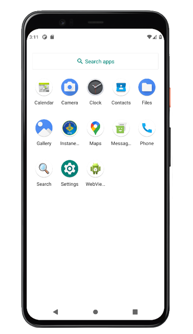

<h1>Simple CMS</h1>

| username | password |
|----------|----------|
| admin    | 12345678 |

<table width="600">
    <tr  width="100">
        <td  align="center" colspan="3"></td>
    </tr>
    <tr>
        <td ></td>
        <td></td>
        <td></td>
    </tr>
<tr>
        <td ></td>
        <td></td>
        <td></td>
    </tr>
<tr>
        <td ></td>
        <td></td>
        <td></td>
    </tr>
</table>

